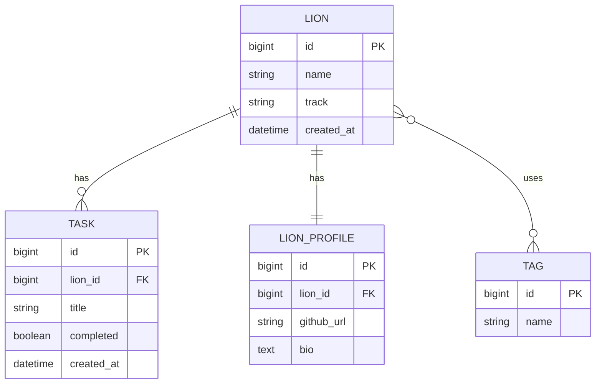

# 아기사자 관리 서비스

## 프로젝트 소개

아기사자 관리 서비스는 Django Template과 ORM을 사용해 Lion, Task, LionProfile, Tag 데이터를 관리하는 HTML 기반 웹 애플리케이션입니다.
6주차 메모리 기반 CRUD에서 시작해 7주차 Model과 MySQL 저장, 8주차 ORM과 QuerySet 조회, 9주차 연관관계와 트랜잭션, 10주차 서비스 통합 정리까지 발전한 프로젝트입니다.

구현 기능은 다음과 같습니다.

- Lion 목록 조회, 검색, 트랙 필터링.
- Lion 생성, 수정, 삭제.
- Lion 생성 시 기본 Task 3개와 LionProfile 자동 생성.
- Task 목록 조회, Task 추가, 완료 상태 토글, 완료/미완료 필터링.
- LionProfile 조회와 수정.
- Tag 추가와 제거 토글.
- Lion 삭제 시 Task와 LionProfile 자동 삭제.

## 기술 스택

- Python 3.10 이상.
- Django 4.x 이상.
- MySQL.
- Django ORM.
- Django Template Engine.

DRF는 사용하지 않으며, 화면은 HTML 템플릿과 `<form>` 태그, `request.POST` 기반으로 처리합니다.
모든 데이터 접근은 Django ORM으로 처리하고 직접 SQL은 작성하지 않습니다.

## 실행 방법

```bash
git clone <repository-url>
cd DjangoApi
python3 -m venv venv
source venv/bin/activate
pip install -r requirements.txt
```

MySQL 데이터베이스를 준비한 뒤 환경 변수나 기본값으로 접속 정보를 맞춥니다.

```bash
export MYSQL_DATABASE=lion_db
export MYSQL_USER=root
export MYSQL_PASSWORD=<mysql-password>
export MYSQL_HOST=127.0.0.1
export MYSQL_PORT=3306
python3 manage.py makemigrations
python3 manage.py migrate
python3 manage.py runserver
```

브라우저에서 `http://127.0.0.1:8000/lions/`로 접속합니다.

## ERD 구조



- `Lion (1) : Task (N)`은 `ForeignKey`와 `on_delete=models.CASCADE`로 구성합니다.
- `Lion (1) : LionProfile (1)`은 `OneToOneField`와 `on_delete=models.CASCADE`로 구성합니다.
- `Lion (N) : Tag (M)`은 `ManyToManyField`로 구성하며 Django가 중간 테이블을 자동 생성합니다.

## 핵심 설계 설명

`ForeignKey`는 한 Lion이 여러 Task를 가지는 1:N 구조에 적합합니다.
`OneToOneField`는 한 Lion이 하나의 프로필만 가져야 하는 1:1 구조에 적합합니다.
`ManyToManyField`는 여러 Lion이 같은 Tag를 공유하고, 하나의 Lion도 여러 Tag를 가질 수 있는 N:M 구조에 적합합니다.

`related_name`은 역방향 조회 이름을 명확하게 만들기 위해 사용합니다.
예를 들어 `lion.tasks.all()`은 Lion에서 Task를 조회하고, `tag.lions.all()`은 Tag에서 연결된 Lion 목록을 조회합니다.
단방향 접근은 필드를 가진 모델에서 상대 모델로 이동하는 조회이고, 양방향 접근은 `related_name`을 통해 반대 방향에서도 조회하는 방식입니다.

`transaction.atomic()`은 Lion 생성, 기본 Task 3개 생성, LionProfile 생성을 하나의 원자적 작업으로 묶기 위해 사용합니다.
중간에 오류가 발생하면 일부 데이터만 저장되는 불일치 상태가 생길 수 있으므로 전체 작업을 롤백해야 합니다.

## 트랜잭션 테스트 설명

롤백은 Lion 생성 중 LionProfile 생성 단계에서 강제 예외를 발생시키는 방식으로 검증합니다.
예외가 발생하면 생성 중이던 Lion과 기본 Task가 모두 저장되지 않아야 합니다.
이 검증은 원자성, 즉 하나의 작업 단위가 모두 성공하거나 모두 취소되는 성질을 확인합니다.

## MVT 구조

- Model은 `Lion`, `Task`, `LionProfile`, `Tag`의 필드와 연관관계를 정의합니다.
- View는 요청을 받아 ORM으로 데이터를 조회하거나 변경하고 템플릿에 필요한 context를 구성합니다.
- Template은 View에서 전달한 데이터를 HTML 화면과 폼으로 표현합니다.

이 프로젝트의 흐름은 `/lions/` 목록에서 Lion을 찾고, `/lions/new/`에서 Lion을 생성하며, `/lions/<id>/` 상세 화면에서 Task, Profile, Tag를 함께 관리하는 구조입니다.

## 주차별 발전 과정

- 6주차는 리스트와 딕셔너리 같은 메모리 기반 CRUD로 기본 흐름을 익혔습니다.
- 7주차는 Django Model과 MySQL로 데이터를 영속 저장했습니다.
- 8주차는 ORM과 QuerySet으로 검색, 필터, 정렬, 개수 조회를 구현했습니다.
- 9주차는 `ForeignKey`, `OneToOneField`, `ManyToManyField`, `transaction.atomic()`으로 관계와 무결성을 설계했습니다.
- 10주차는 중복 조회 로직, 예외 처리, README, 서비스 흐름을 정리해 완성된 프로젝트 형태로 통합했습니다.
